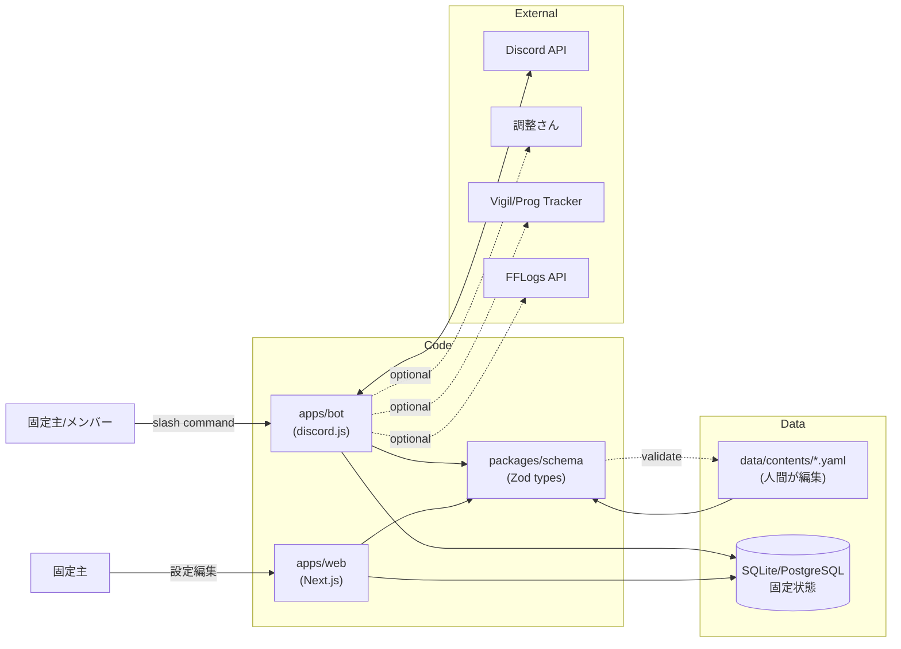

# Architecture

## 全体構成

## レイヤー

1. **Schema layer** (`packages/schema`)
   - 全レイヤーの契約
   - Zod による runtime validation + 静的型
   - YAML loader を兼ねる

2. **Data layer**
   - **静的データ** (`data/contents/*.yaml`): FF14コンテンツの公開情報
   - **動的データ** (DB): 固定パーティ・スケジュール・進行度

3. **Application layer**
   - **Bot** (`apps/bot`): Discord I/O、コマンド処理、通知
   - **Web** (`apps/web`): GUI（軽減回し編集、テンプレジェネレーター）

4. **Integration layer**
   - 外部サービス連携（オプション、段階的に追加）

## なぜこの構成か

- **schema を契約に**: 並列作業を可能にする
- **静的データを YAML に**: コード変更なしでコンテンツ追加可能、PRレビュー可能
- **Bot/Web 分離**: Discord と Web 両方で同じデータを扱うため

## 未決定事項
- DB の選択（SQLite + LiteFS vs Managed PostgreSQL）
- Bot のホスティング先（Fly.io / Railway / VPS）
- Web のホスティング先（Vercel 想定）
