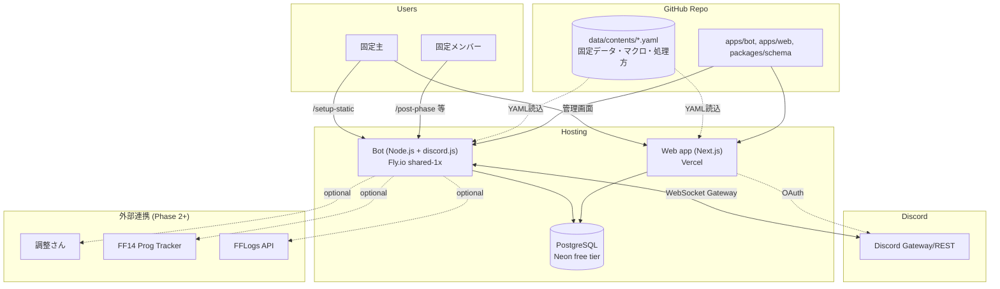

# Tech Stack 決定ドキュメント

> 本ドキュメントの目的: 公開 Discord bot として FF14 固定支援を全FFユーザーに提供するための技術スタック・コスト・運用要件を整理し、共同開発者と方針を揃える。

最終更新: 2026-05-25

---

## 1. プロダクト前提

| 項目 | 内容 |
|---|---|
| プロダクト | FF14 固定パーティ支援 Discord bot + 管理 Web app |
| ターゲット | 日本語FF14 コミュニティ（絶/零式に挑む固定パーティ） |
| 提供形態 | **公開Bot**（誰でも自分のDiscord guildに招待可能、マルチテナント） |
| 収益化 | 当面なし（任意で投げ銭・スポンサー想定） |
| 初期規模 | 〜50固定/月 |
| 1年目目標 | 〜500固定 / 100+ servers |
| 主な機能 | コンテンツ選択→Phaseチャネル/動画/マクロ自動展開、募集テンプレ、スケジューラ、進行度トラッカー |

---

## 2. システム構成



主要な特徴:
- **Bot と Web app が同じ DB を共有**（StaticParty/Schedule/Progress などのレコード）
- **コンテンツデータは静的 YAML**（PR レビュー可能、bot/web 両方が読み込み）
- **外部連携は段階的**（MVP では Discord + DB のみ）

---

## 3. 推奨 Tech Stack（一覧）

| レイヤー | 推奨 | バージョン | ライセンス |
|---|---|---|---|
| 言語 | TypeScript | 5.6+ | Apache 2.0 |
| ランタイム | Node.js | 22 LTS | MIT |
| パッケージ管理 | pnpm | 11.x | MIT |
| Bot library | discord.js | 14.16+ | Apache 2.0 |
| Web framework | Next.js | 15 (App Router) | MIT |
| UI | shadcn/ui + Tailwind CSS | latest | MIT |
| Auth | Auth.js (NextAuth v5) Discord provider | 5.x | ISC |
| ORM | Drizzle ORM | 0.36+ | Apache 2.0 |
| Schema validation | Zod | 3.x | MIT |
| データ形式 | YAML | - | - |
| Bot hosting | Fly.io | - | (PaaS) |
| Web hosting | Vercel | - | (PaaS) |
| DB | Neon Postgres (or Fly Postgres) | 16+ | PostgreSQL |
| Error tracking | Sentry | - | BSL/MIT |
| Logging | pino → Better Stack | 9.x | MIT |
| CI/CD | GitHub Actions | - | - |
| ドメイン | Cloudflare Registrar | - | - |

---

## 4. 各レイヤーの選定理由と代替

### 4.1 Bot Hosting

**推奨: Fly.io** ([fly.io](https://fly.io))

| 観点 | 評価 |
|---|---|
| **Discord WebSocket 対応** | ✅ 常時起動コンテナ、Gateway接続維持OK |
| **デプロイ容易性** | ✅ Dockerfile + fly.toml で `fly deploy` 一発 |
| **コスト** | ✅ 月$5 クレジット付与、shared-cpu-1x 256MB なら無料枠内 |
| **JP リージョン** | ✅ NRT (東京) リージョンあり、レイテンシ低 |
| **コミュニティ** | ✅ Discord bot 界隈で広く採用されている |
| **DB 同居** | ✅ Fly Postgres あり |
| **欠点** | ⚠️ クレジットカード必須（無料利用も登録必要）、たまにメンテで再起動 |

#### 代替案

| 選択肢 | コスト | 向き不向き |
|---|---|---|
| **Railway** ([railway.app](https://railway.app)) | $5/mo min | デプロイは Fly.io より更に簡単。ただし無料tier撤廃済み、minimum spend あり |
| **Render** ([render.com](https://render.com)) | $7/mo (Web service) | Web service は良いが、無料tierは sleep する → Discord bot には NG |
| **Cloud Run** (GCP) | min-instances=1 で月$5-10 | 常時起動コンテナとして使える。Fly.io と同等だが GCP コンソール操作必要 |
| **Heroku** | $5/mo (Eco) | 古参、安定。料金は Fly.io と同じくらい |
| **Hetzner VPS** | $4/mo (ARM CAX11) | 一番安いが OS/security update を自分で。Postgres も自分で立てる必要あり |
| **AWS Fargate / ECS** | $15+/mo | 過剰、初期向きでない |
| **Self-hosted (自宅Raspberry Pi 等)** | $0 (電気代除く) | 個人用なら可。公開Botとしては停電・回線リスクあり |

**結論**: Fly.io が「Discord botを公開運用」の最小フリクション。GCP既存資産があれば Cloud Run も同等。

---

### 4.2 Database

**推奨: Neon Postgres** ([neon.tech](https://neon.tech))

| 観点 | 評価 |
|---|---|
| **無料tier** | ✅ 0.5GB storage + autosuspend (idle時無料) |
| **スケール** | ✅ serverless Postgres、branch機能 (preview環境作成楽) |
| **マイグレーション** | ✅ 標準 SQL、`drizzle-kit` でversion管理 |
| **Discord bot 用途** | ✅ コネクションプール提供、Fly.io から低レイテンシ接続可 |
| **欠点** | ⚠️ JPリージョンなし（US-West/East、Frankfurt、Singapore）→ Fly.io NRT との通信は SG経由で50ms程度 |

#### 代替案

| 選択肢 | コスト | 特徴 |
|---|---|---|
| **Fly Postgres** | shared-1x で月$2、HA構成で月$30+ | Fly.io と同リージョン (NRT) でレイテンシ最良。マネージドだが backup は自分で考慮 |
| **Supabase** ([supabase.com](https://supabase.com)) | 無料tier (0.5GB) → Pro $25/mo | Postgres + Auth + Storage が一体。Authを Supabase 任せにする場合は強い |
| **PlanetScale** | 無料tier廃止、$29/mo〜 | MySQL系。Discord bot で MySQLを使う理由は薄い |
| **Firestore** | 無料tier大きい、従量課金 | NoSQL。複雑なクエリ（「この guild の全Schedule で今後7日」等）が辛い |
| **SQLite + LiteFS (Fly.io)** | $0 | ファイルベース、Fly.io 内で replication。マルチテナント用途では一貫性課題 |

**結論**: 初期は **Neon 無料tier**、必要に応じて **Fly Postgres NRT** に移行（レイテンシ最適化）。

---

### 4.3 ORM

**推奨: Drizzle ORM** ([orm.drizzle.team](https://orm.drizzle.team))

| 比較 | Drizzle | Prisma |
|---|---|---|
| バンドルサイズ | 小（~30KB） | 大（クライアント数MB） |
| TypeScript型生成 | ランタイム不要、純TS | 別途 generate コマンド |
| Edge runtime対応 | ✅ | △ (Edge Client必要、有料機能) |
| SQL寄りの記述 | ✅ Query builder + Raw SQL混在可 | △ 独自DSL |
| Migration | drizzle-kit (CLI) | prisma migrate |
| エコシステム | 成長中 | 圧倒的大手、example豊富 |
| Discord bot 採用例 | 増加中 | 多数 |

**結論**: 軽量さと TS-first 設計で **Drizzle**。学習曲線も緩い。Prismaの方が情報量は多いので、難所で詰まるなら切替可（ORMはlayerが薄いので)。

---

### 4.4 Web App

**推奨: Next.js 15 (App Router) + Vercel**

理由:
- **Vercel**: Next.js純正、無料 Hobby tier で十分（100GB帯域/月、Serverless Function 100K回/月）
- **App Router**: React Server Components で初期表示高速
- **Edge runtime**: 認証チェック等を Edge で実行できる
- **shadcn/ui**: コピー&ペースト型コンポーネント集、デザイン自由度高い

#### 代替案
- **Remix / React Router 7**: Next.jsの代わり。フォーム駆動UIに強い
- **SvelteKit**: より軽量、TS型推論強い
- **Cloudflare Pages**: Vercelより安いがNext.js のSSR制限あり
- **Astro**: 静的サイト寄り、管理画面には不向き

**結論**: Next.js + Vercel が de facto。乗り換えコストも将来低い。

---

### 4.5 Auth

**推奨: Auth.js v5 (旧NextAuth) Discord provider**

理由:
- Discordユーザー（=botの主要ユーザー）にとってシームレス
- 別途アカウント作成不要
- Auth.js v5 は App Router対応、TypeScript型強い
- Discord OAuth scope: `identify` + `guilds` で必要十分

セッション戦略:
- JWT セッション（DB不要）or DB セッション（Postgres にsessionテーブル）
- 推奨: **DB セッション**（強制ログアウト・複数デバイス管理可）

#### 代替案
- **Clerk** ([clerk.com](https://clerk.com)): UI完成度高い、Discord OAuth対応、無料10K MAU。ただし依存度上がる
- **Supabase Auth**: DBにSupabase使うなら一体運用しやすい
- **自前 OAuth**: Discord OAuth は標準的なので可だが、車輪の再発明

**結論**: **Auth.js v5** が最小コストで Discord OAuth実現。

---

### 4.6 Error Tracking

**推奨: Sentry** ([sentry.io](https://sentry.io))

- 無料tier: 5K errors/月、1ユーザー
- Node.js (bot) + Next.js (web) 両方公式SDK
- Sourcemap対応 → minify後のスタックトレースも読める
- Release tracking で「どのデプロイから増えたエラーか」追える

#### 代替案
- **Highlight.io**: Session replay付き、Web app寄り
- **Better Stack** (Logtail + Uptime): ログ+監視一体
- **自前 (Loki + Grafana)**: 安いが運用負荷高

**結論**: **Sentry 無料tier** で開始、超えそうなら Highlight.io へ。

---

### 4.7 Logging

**推奨: pino + Fly.io built-in logs (→ 必要なら Better Stack)**

- **pino**: 最速の Node.js logger、JSON出力
- **Fly.io logs**: `fly logs` で常時tail、過去ログは限定（数時間〜数日）
- **Better Stack 無料tier**: 1GB/月、Fly.io と連携設定簡単
- 後で長期保存・検索が欲しくなったら Better Stack 有料 ($25/mo〜)

---

### 4.8 Monitoring / Uptime

**推奨: Better Stack Uptime** (旧Better Uptime)

- 無料tier: 10 monitors、3分間隔
- Discord通知統合（bot が落ちたら自分の Discord に push）
- Status page も無料で作れる（status.your-domain.com）

代替: UptimeRobot (古参、無料50 monitors)、Pingdom (有料)

---

### 4.9 CI/CD

**推奨: GitHub Actions**

現状の CI workflow（typecheck + validate-data）に追加していく:
1. ✅ Typecheck
2. ✅ Validate content YAML
3. **未実装**: Test suite (`pnpm -r test`)
4. **未実装**: Deploy to Fly.io on `main` push
5. **未実装**: Vercel auto-deploy (Vercel side で設定)
6. **未実装**: Database migration check

無料tier: public repo なら無制限、private repo は 2000分/月（十分）

---

### 4.10 ドメイン

**推奨: Cloudflare Registrar**

- 原価販売（マークアップなし）
- `.com` 年$10-11、`.app` 年$14、`.bot` 年$70
- DNS、TLS、CDN すべてCloudflare で完結

候補名（要 availability チェック）:
- `ff14kotei.app`
- `kotei.bot`
- `ffstatic.app`
- 何か覚えやすい日本語ローマ字系

---

## 5. コスト試算

### Phase A: ソフトローンチ（1〜50固定 / 〜10 servers）

| 項目 | サービス | 月額 |
|---|---|---|
| Bot hosting | Fly.io shared-1x 256MB | $0（無料枠内） |
| DB | Neon free tier (0.5GB) | $0 |
| Web hosting | Vercel Hobby | $0 |
| ドメイン | Cloudflare Registrar | $1 (年$10〜15÷12) |
| Error tracking | Sentry free | $0 |
| Uptime | Better Stack free | $0 |
| Logs | Fly.io built-in | $0 |
| **合計** | | **~$1/月** |

### Phase B: グロース（50〜500固定 / 〜100 servers）

| 項目 | サービス | 月額 |
|---|---|---|
| Bot hosting | Fly.io shared-1x 512MB + cron worker | $5-8 |
| DB | Neon free → Pro移行 or Fly Postgres 3GB | $0-19 |
| Web hosting | Vercel Hobby (まだ無料枠内見込) | $0 |
| ドメイン | Cloudflare | $1 |
| Error tracking | Sentry free | $0 |
| Uptime | Better Stack free | $0 |
| Logs | Better Stack (1GB) | $0 |
| **合計** | | **~$10-25/月** |

### Phase C: スケール（500〜5000固定 / 〜1000 servers）

| 項目 | サービス | 月額 |
|---|---|---|
| Bot hosting | Fly.io dedicated-1x 1GB + worker | $30-50 |
| DB | Neon Scale ($69) or Fly Postgres 10GB HA | $30-69 |
| Web hosting | Vercel Pro | $20 |
| ドメイン | Cloudflare | $1 |
| Error tracking | Sentry Team | $0-26 |
| Uptime | Better Stack | $0-25 |
| Logs | Better Stack | $0-25 |
| CDN/Assets | Cloudflare (R2 でアセット) | $0-5 |
| **合計** | | **~$80-200/月** |

### Phase D: 大規模（5000固定+ / 5000+ servers）

- bot verification 済、sharding 必須（discord.js 自動対応）
- 月額 $300-1000+、典型的には donation/sponsor で運営

---

## 6. データ運用フロー

### コンテンツデータ更新パイプライン

新コンテンツ実装時 or 既存処理方変更時の流れ:

```
新コンテンツ実装 (例: 新絶コンテンツ)
    ↓
[ステージ1] 情報収集 (1-2週)
    - 攻略動画チェック
    - りりーどーる/ふうcだよ更新待ち
    - 野良主流が固まるまで待つ
    ↓
[ステージ2] YAML作成
    - data/contents/<id>.yaml を _template.yaml からコピー
    - 出典付きで埋める
    ↓
[ステージ3] PR + Review
    - GitHub PR
    - FF14 詳しい人にレビュー依頼 (or 自分で再確認)
    ↓
[ステージ4] マージ → 自動デプロイ
    - main マージで Fly.io 自動デプロイ
    - Bot 再起動で新データ反映
```

### コミュニティ寄稿（Phase B以降）

オプション:
- **(A)** GitHub PR で受付（技術ハードル高、品質高）
- **(B)** Discord 「データ寄稿チャネル」で submit → 管理者が手動 YAML 化（楽だが運営側負荷）
- **(C)** Web app に「コンテンツ提案フォーム」→ レビュー後マージ（実装重い、ユーザフレンドリー）

**MVP**: 自分で更新 → 慣れたら (A) 開放 → 需要次第で (C) 構築

---

## 7. Privacy / Terms / Compliance

### 必要なもの

| 項目 | 必要時期 | 対応 |
|---|---|---|
| Privacy Policy | **公開前必須**（Discord guildに招待した瞬間からユーザーデータ収集） | テンプレ + 自前カスタマイズで1-2時間 |
| Terms of Service | 推奨 | 同上 |
| Bot verification | **100 servers到達で必須** | 申請 → 審査1-2週間、URLs必要 |
| GDPR対応 | EUユーザーいる時 | データ削除リクエスト対応、cookie consent (Web app) |
| 特定商取引法表記 | 課金開始時 | 個人運営なら住所開示が必要 |

### Privacy Policy に書くこと（Discord bot 特有）

- 収集するデータ: Discord User ID, Guild ID, Channel ID, 設定したコンテンツ・スケジュール
- 利用目的: bot機能提供のみ
- 第三者提供: なし
- データ保存場所: Neon (US) or Fly Postgres (JP)
- 削除リクエスト: Discord で `/data delete` コマンド or 連絡先メール
- Cookie: Web app のみ、auth セッション用

### Bot 招待時の権限スコープ

最小権限の原則:
- **必須**: `Send Messages`, `Embed Links`, `Read Message History`, `Use Slash Commands`
- **オプション (機能依存)**: `Manage Channels`（B-2 setup-static）, `Mention Everyone`（通知用）, `Add Reactions`

`Administrator` 権限は **絶対要求しない**。要求すると怖がられて招待されない。

---

## 8. 想定リスクと対策

| リスク | 影響 | 対策 |
|---|---|---|
| **Bot ダウンタイム** | 全ユーザー機能停止 | Better Stack uptime + Discord 通知、Fly.io health check、graceful shutdown 実装 |
| **DB データ消失** | 固定データ全滅 | Neon 自動バックアップ (point-in-time recovery 7日)、月次手動 dump 推奨 |
| **Discord rate limit** | 一時的にコマンド応答失敗 | discord.js は自動 retry、爆発的成長時は sharding（5000+ servers で必須） |
| **コンテンツデータ陳腐化** | 古い処理方を投稿、混乱 | データに `lastVerifiedAt` フィールド追加（要 schema 変更）、3ヶ月以上未更新でwarning |
| **マクロ著作権・出典クレーム** | 「無断転載やめろ」と言われる | データに出典明記（既に実装）、要請あれば即削除のフロー整備 |
| **Discord ToS違反** | bot アカウント停止 | ToS 厳守、特に user data scraping/storage しない、verified bot 申請推奨 |
| **依存ライブラリの zero-day** | セキュリティ穴 | Dependabot 有効化（GitHub 標準）、毎月 `pnpm update` |
| **Fly.io / Neon の障害** | サービス停止 | 他クラウドへの移行計画（IaC化、ベンダーロックイン回避）。short-term は status page 表示 |
| **想定外の課金** | 予算オーバー | Fly.io / Neon ともに spending limit設定可。Sentry / Vercel も alert 設定 |
| **コミュニティからの過剰要求** | 開発負荷 | ロードマップ公開、issue triage、コントリビューションガイド明記 |

---

## 9. 必要なスキルセット

### 必須
| スキル | 用途 | 学習リソース |
|---|---|---|
| TypeScript | Bot + Web 全般 | 公式 handbook |
| React (基礎) | Web app | Next.js tutorial |
| Discord API 基礎 | Bot 機能設計 | discord.js guide |
| SQL 基礎 | DB schema 設計 | Drizzle docs |
| Git / GitHub | コード管理 | 既知 |

### 推奨
- Docker 基礎（Fly.io デプロイ）
- Postgres 中級（index 設計、explain）
- CI/CD 基礎（GitHub Actions）

### 外注可能 / 後回し可
- UI/UXデザイン（shadcn/ui で十分スタート可）
- ブランディング（ロゴ、bot avatar）
- コミュニティマネジメント（Discord support server運営）

---

## 10. 開発ロードマップ

### Month 1: MVP 完成

- ✅ Phase 1 コマンド (B-1〜B-4) 完成
- ⏳ **DB schema + Drizzle 導入**（packages/db 新設）
- ⏳ **B-5: スケジューラ + 開始N分前アラート**（DB依存）
- ⏳ **Fly.io デプロイ**（Dockerfile, fly.toml, secrets, CI deploy step）
- ⏳ **自分の固定で1〜2週間 dogfood**
- ⏳ Privacy Policy + ToS テンプレ作成

### Month 2: ソフトローンチ

- Web app 雛形（NextAuth + 簡単な管理画面）
- β 招待: 5〜10固定（知人経由）
- フィードバック反映、バグfix
- Better Stack / Sentry 統合
- Status page 公開

### Month 3-4: 公開準備

- Privacy Policy / ToS 仕上げ
- Bot 招待リンク生成 + support guild 構築
- Twitter等で告知 + landing page
- Bot avatar / branding

### Month 5-6: グロース

- 他コンテンツ data 追加（絶オメガ、絶竜詩、零式各層）
- Web app: 軽減回しエディタ (W-1)
- 募集テンプレジェネレーター UI 改善
- コミュニティ寄稿フロー整備

### Month 6+: スケール

- Bot verification 申請（100 servers到達後）
- 進行度トラッカー (Vigil / FFLogs 連携)
- 異聞/詩想 等他コンテンツ拡張
- 公式 Twitter / Discord support server 拡張

---

## 11. 意思決定が必要な項目

| # | 項目 | 推奨 | 代替 | 期限 |
|---|---|---|---|---|
| 1 | Bot hosting | Fly.io | Cloud Run, Railway, Hetzner | MVP デプロイ前 |
| 2 | DB | Neon Postgres | Fly Postgres, Supabase, Firestore | MVP デプロイ前 |
| 3 | ORM | Drizzle | Prisma | DB導入前 |
| 4 | Web hosting | Vercel | Cloudflare Pages | Web app 開発前 |
| 5 | Auth | Auth.js v5 | Clerk, Supabase Auth | Web app 開発前 |
| 6 | Domain名 | (未定) | - | β招待前 |
| 7 | Bot 名前 + branding | (未定) | - | β招待前 |
| 8 | Privacy Policy / ToS 言語 | 日本語のみ → 英語追加 | 最初から多言語 | 公開前 |
| 9 | コミュニティ寄稿方式 | GitHub PR から開始 | Web フォーム | Month 4頃 |
| 10 | 収益化方針 | しない / 投げ銭のみ | サブスク / 広告 | 1年目には不要 |

---

## 12. 参考リンク

- discord.js Guide: https://discordjs.guide/
- Fly.io Pricing: https://fly.io/docs/about/pricing/
- Neon Pricing: https://neon.tech/pricing
- Vercel Pricing: https://vercel.com/pricing
- Auth.js v5 Docs: https://authjs.dev/
- Drizzle ORM: https://orm.drizzle.team/
- Discord Bot Verification: https://support.discord.com/hc/en-us/articles/360040720412
- shadcn/ui: https://ui.shadcn.com/

---

## 付録 A: 簡易デシジョンマトリクス（共同開発者用）

「迷ったらどっち選ぶ？」ガイド:

| 状況 | 選ぶべき |
|---|---|
| 「Discord botを最短で公開したい」 | Fly.io + Neon + Vercel |
| 「GCP使ってるので統一したい」 | Cloud Run + Cloud SQL + Firebase Hosting |
| 「とにかく最安」 | Hetzner VPS + 自前Postgres + Cloudflare Pages（運用負担覚悟） |
| 「将来の柔軟性最大化したい」 | AWS Fargate + RDS + CloudFront（オーバーキル感あり、知見必須） |
| 「個人用で公開しない」 | Raspberry Pi or 自宅サーバー + SQLite |

---

## 付録 B: 月額コスト比較サマリ

| Phase | 規模 | Fly.io+Neon (推奨) | Cloud Run+Cloud SQL | Hetzner self-host |
|---|---|---|---|---|
| A: MVP | 1-50固定 | $1 | $10 | $4 |
| B: グロース | 50-500固定 | $10-25 | $30-50 | $10 (運用工数別) |
| C: スケール | 500-5000固定 | $80-200 | $150-300 | $30-50 (運用大変) |
| D: 大規模 | 5000+ | $300-1000+ | $500-1500+ | 非現実的 |

---

## 改訂履歴

| 日付 | 内容 | 変更者 |
|---|---|---|
| 2026-05-25 | 初版作成 | Claude (Opus 4.7) with mitchkunn |
